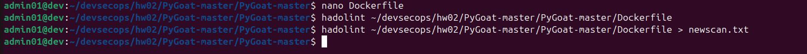
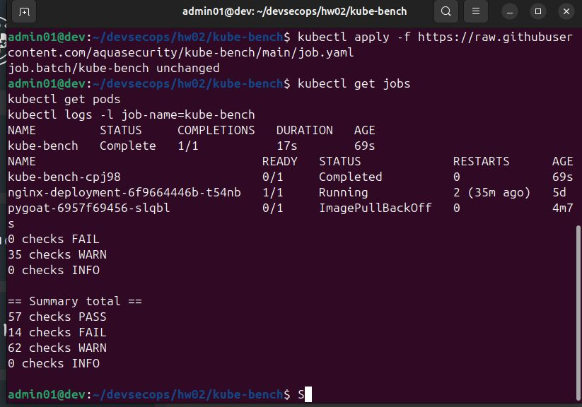
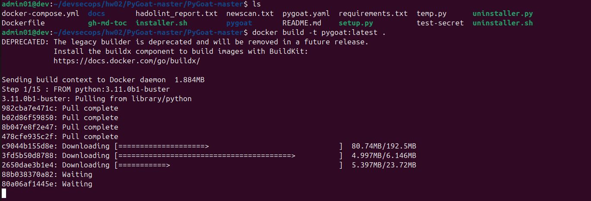
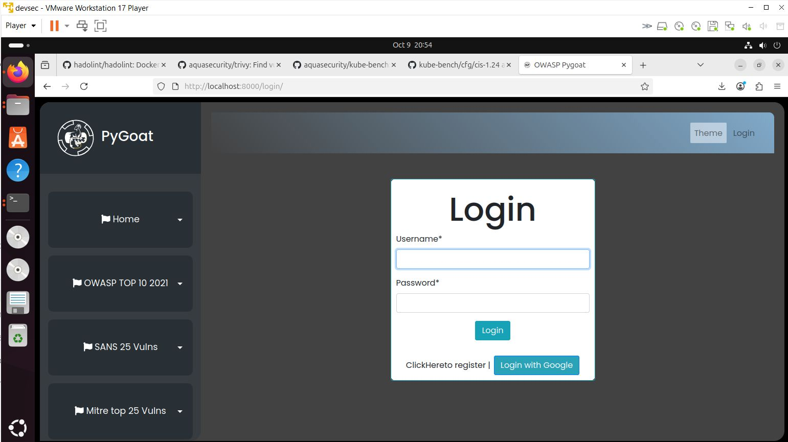
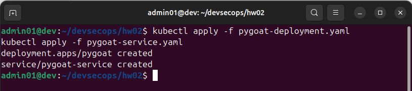
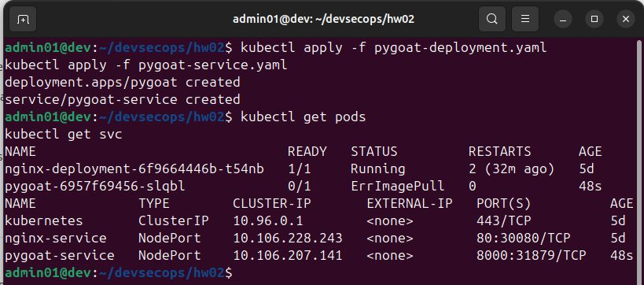

# 🧩 Домашнее задание №5 — Средства защиты DevOps-инфраструктуры

**Дисциплина:** Разработка защищённых программных систем  
**Тема:** Средства защиты DevOps-инфраструктуры  
**Цель:** Научиться применять инструменты анализа безопасности контейнеров и кластеров Kubernetes (Hadolint, Trivy, kube-bench).

---

## ⚙️ Используемые инструменты

- **Docker** — контейнеризация приложения PyGoat  
- **Kubernetes (Minikube)** — развёртывание кластера  
- **Hadolint** — проверка Dockerfile на best practices  
- **Trivy** — сканирование контейнерного образа на уязвимости  
- **kube-bench** — аудит конфигурации кластера Kubernetes по CIS Benchmark

---

## 📂 Структура репозитория

```
HW05/
│
├── cmd/
│   ├── [Hadolint](cmd/Hadolint.txt)
│   └── [Trivy](cmd/Trivy.txt)
│
├── config/
│   ├── [Dockerfile](config/Dockerfile)
│   ├── [pygoat-deployment.yaml](config/pygoat-deployment.yaml)
│   └── [pygoat-service.yaml](config/pygoat-service.yaml)
│
├── report/
│   ├── [04_kube_check.txt](report/04_kube_check.txt)
│   └── [trivy_report.txt](report/trivy_report.txt)
│
├── screen/
│   ├── [04_kube_check.jpg](screen/04_kube_check.jpg)
│   ├── [build.jpg](screen/build.jpg)
│   ├── [kuber_test.jpg](screen/kuber_test.jpg)
│   ├── [localhost.jpg](screen/localhost.jpg)
│   ├── [manifest_kuber.jpg](screen/manifest_kuber.jpg)
│   ├── [scan_hadolint.jpg](screen/scan_hadolint.jpg)
│   └── [scan_hadolint_new.jpg](screen/scan_hadolint_new.jpg)
│
└── README.md
```

---

## 🔧 Этап 1. Установка и использование Hadolint

1. **Установка:**
   ```bash
   sudo wget https://github.com/hadolint/hadolint/releases/download/v2.14.0/hadolint-x86_64-linux-standalone -O /usr/local/bin/hadolint
   sudo chmod +x /usr/local/bin/hadolint
   ```
   ([см. cmd/Hadolint.txt](cmd/Hadolint.txt))

2. **Проверка Dockerfile:**
   ```bash
   hadolint config/Dockerfile
   ```

3. **Результаты:**
   - До исправлений — 
   - После исправлений — 

---

## 🧪 Этап 2. Проверка контейнера с помощью Trivy

1. **Установка:**
   ```bash
   wget -qO - https://aquasecurity.github.io/trivy-repo/deb/public.key | sudo apt-key add -
   echo "deb https://aquasecurity.github.io/trivy-repo/deb $(lsb_release -sc) main" | sudo tee -a /etc/apt/sources.list.d/trivy.list
   sudo apt-get update
   sudo apt-get install -y trivy
   ```
   ([см. cmd/Trivy.txt](cmd/Trivy.txt))

2. **Сканирование:**
   ```bash
   trivy image pygoat:latest
   ```
   Отчёт — [report/trivy_report.txt](report/trivy_report.txt)

---

## ☸️ Этап 3. Проверка кластера Kubernetes с kube-bench

1. **Запуск проверки:**
   ```bash
   kubectl apply -f https://raw.githubusercontent.com/aquasecurity/kube-bench/main/job.yaml
   kubectl logs -l job-name=kube-bench
   ```

2. **Результат:**
   ```
   == Summary total ==
   57 checks PASS
   14 checks FAIL
   62 checks WARN
   ```
   - Лог: [report/04_kube_check.txt](report/04_kube_check.txt)  
   - Скриншот: 

---

## 🐳 Этап 4. Запуск PyGoat в Docker

1. **Сборка и запуск:**
   ```bash
   docker build -t pygoat:latest -f config/Dockerfile .
   docker run -d -p 8000:8000 pygoat:latest
   ```
   Скриншот сборки: 

2. **Результат:**
   Приложение доступно по адресу [http://localhost:8000](http://localhost:8000)  
   

---

## ☁️ Этап 5. Развёртывание PyGoat в Kubernetes

1. **Манифесты Deployment и Service:**
   - [config/pygoat-deployment.yaml](config/pygoat-deployment.yaml)
   - [config/pygoat-service.yaml](config/pygoat-service.yaml)

2. **Применение:**
   ```bash
   kubectl apply -f config/pygoat-deployment.yaml
   kubectl apply -f config/pygoat-service.yaml
   kubectl get pods
   kubectl get svc
   ```
   

3. **Результат:**
   Приложение успешно развёрнуто в кластере Kubernetes  
   

---

## ✅ Самопроверка

| № | Этап | Скриншоты / файлы | Статус |
|:-:|------|--------------------|:------:|
| 1 | Проверка Dockerfile (Hadolint) | `scan_hadolint.jpg`, `scan_hadolint_new.jpg` | ✔ |
| 2 | Проверка уязвимостей (Trivy) | `trivy_report.txt` | ✔ |
| 3 | Проверка кластера (kube-bench) | `04_kube_check.txt`, `04_kube_check.jpg` | ✔ |
| 4 | Запуск PyGoat (Docker) | `build.jpg`, `localhost.jpg` | ✔ |
| 5 | PyGoat в Kubernetes | `manifest_kuber.jpg`, `kuber_test.jpg` | ✔ |

---

**Автор:** *Vitaliy Novikov (HSE, Разработка защищённых систем)*  
**Время выполнения:** ~7 часов  
**Цель достигнута:** выполнена комплексная проверка безопасности DevOps-инфраструктуры с использованием инструментов Aqua Security и лучших практик CI/CD.
