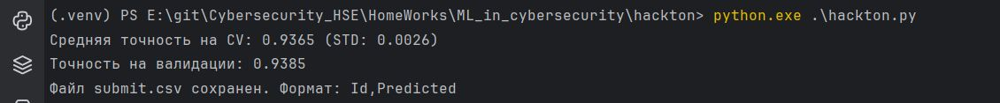

# 🧠 Практическая работа №4 — Хакатон по машинному обучению в кибербезопасности

## 📂 Структура проекта

```
hackton/
├── docs/
│   └── Практическая 4. Хакатон.pdf
├── screens/
│   └── report.jpg
├── scripts/
├── train.csv
├── test.csv
├── sample_submit.csv
├── submit.csv
├── hackton.py
├── hackton_v2.py
└── hackton_test.py
```

## 🎯 Цель работы

Разработать и обучить модель машинного обучения для **обнаружения фишинговых URL**  
(классификация на фишинговые / нефишинговые сайты)  
в рамках курса *«Machine Learning in Cybersecurity» (ВШЭ)*.

## ⚙️ Описание решения

Основной скрипт — [`hackton.py`](./hackton.py).  
Он объединяет **ручные признаки URL** и **символьную TF-IDF-векторизацию**, а затем обучает модель **RandomForestClassifier**.

### 🔹 Основные этапы

1. **Загрузка данных**
   - Используются файлы `train.csv` и `test.csv`
   - Целевая переменная — `result`

2. **Извлечение признаков (`extract_features`)**
   - длина URL (`url_length`)
   - наличие IP в домене (`has_ip`)
   - количество поддоменов (`num_subdomains`)
   - наличие HTTPS (`has_https`)
   - количество спецсимволов (`num_special_chars`)
   - количество подозрительных слов (`suspicious_words`)
     *(login, secure, bank, update, paypal, account, verify)*

3. **TF-IDF (символьный уровень)**
   ```python
   TfidfVectorizer(analyzer='char', ngram_range=(2, 5), max_features=5000)
   ```

4. **Объединение признаков**
   ```python
   X_train = np.hstack((tfidf_vectors, handcrafted_features))
   ```

5. **Модель**
   ```python
   RandomForestClassifier(n_estimators=100, random_state=42)
   ```

6. **Оценка модели**
   - 5-fold кросс-валидация: **CV = 0.9365 (STD = 0.0026)**
   - Валидация (20% hold-out): **Accuracy = 0.9385**

7. **Сохранение результата**
   - Формируется файл `submit.csv`:
     ```
     Id,Predicted
     0,0
     1,1
     ...
     ```

## 🚀 Как запустить

### 1️⃣ Установить зависимости
```bash
pip install pandas numpy scikit-learn
```

### 2️⃣ Запустить модель
```bash
python hackton.py
```

После успешного запуска в консоли:
```
Средняя точность на CV: 0.9365 (STD: 0.0026)
Точность на валидации: 0.9385
Файл submit.csv сохранен. Формат: Id,Predicted
```

Скриншот результата:  


## 📊 Результаты

| Этап | Модель | CV Accuracy | Validation Accuracy |
|------|---------|--------------|---------------------|
| Baseline (TF-IDF + handcrafted) | RandomForest(100) | 0.9365 | 0.9385 |

## 📎 Материалы и источники

- [`docs/Практическая 4. Хакатон.pdf`](./docs/Практическая%204.%20Хакатон.pdf)
- Статья IEEE: *“Phishing URL Detection using Machine Learning and Feature Engineering”*
- Примеры решений с хакатона CyberHackAI

## 👩‍💻 Автор

**ФИО:** *V. S. Novikov*  
**Курс:** Machine Learning in Cybersecurity (ВШЭ)  
**Дата:** Октябрь 2025
