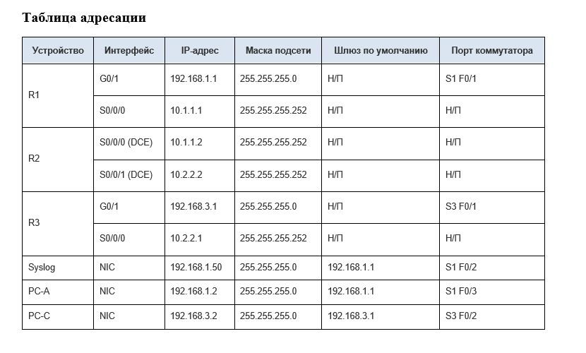

# IPS + Basic Network Hardening (DZ 28 / 29)

Лабораторная работа демонстрирует настройку базовой маршрутизации, включение **IOS IPS** на R1 и отправку журналов на централизованный Syslog-сервер.

<p align="center">
  
</p>

---

## 1. Описание стенда

| Узел | Роль | IPv4 |
|------|------|------|
| **R1** | Головной маршрутизатор LAN 1, IPS | 192.168.1.1 /24, 10.1.1.1 /30 |
| **R2** | Транзитный | 10.1.1.2 /30, 10.2.2.2 /30 |
| **R3** | Граница LAN 3 | 192.168.3.1 /24, 10.2.2.1 /30 |
| **S1/S3** | Коммутаторы доступа | VLAN 1 |
| **Syslog** | Централизованный сбор логов | 192.168.1.50 |

Полная таблица адресации находится в `screens/table28.jpg`:



---

## 2. Структура репозитория

```
.
├── configs/      # готовые конфиги устройств (Markdown)
│   ├── R1.md
│   ├── R2.md
│   ├── R3.md
│   ├── S1.md
│   └── S3.md
├── docs/         # исходные материалы
│   ├── ДЗ тема 29 Системы обнаружения и предотвращения вторжений.docx
│   └── IPS.pka   # Packet Tracer 8.x файл с топологией
├── screens/      # скриншоты проверки
│   ├── R1_show.jpg
│   ├── R1_show_OSPF.jpg
│   ├── ...
│   └── syslog_server.jpg
└── README.md
```

---

## 3. Быстрый старт

1. Откройте `docs/IPS.pka` в **Cisco Packet Tracer 8.x**.  
2. На каждом маршрутизаторе выполните команду  
   `crypto key generate rsa modulus 1024`  
   (ключи RSA нельзя сохранить в .pka, поэтому их надо сгенерировать вручную при первом запуске).
3. Установите текущее время:  
   `clock set HH:MM:SS DD MON YYYY`
4. Проверка:  
   * `ping 192.168.3.2` с **PC-A** и `ping 192.168.1.2` с **PC-C**  
   * окно **SYSLOG** должно фиксировать сообщения `%IPS-4-SIGNATURE`.

---

## 4. Конфигурации устройств

* **Маршрутизаторы**
  * [R1.md](./configs/R1.md) – включает IOS IPS  
  * [R2.md](./configs/R2.md)  
  * [R3.md](./configs/R3.md)
* **Коммутаторы**
  * [S1.md](./configs/S1.md)  
  * [S3.md](./configs/S3.md)

Каждый файл можно скопировать целиком в консоль соответствующего устройства (`Ctrl-Shift-V`), затем выполнить `wr` для сохранения.

---

## 5. Полезные команды

```plaintext
# R1: отладка IPS
debug ip ips events
undebug all

# Все R*: OSPF-состояние
show ip ospf neighbor
show ip route ospf

# Syslog-сервер Packet Tracer
Desktop → SYSLOG
```

---

## 📂 Примечания

> _Репозиторий создан в рамках курса "Защита компьютерных сетей и систем" направления "Кибербезопасность", НИУ ВШЭ._
