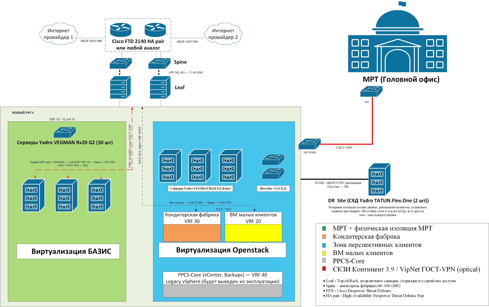

# Проект модернизации PPCS

> **Цель**: отделить критичные данные МРТ, запустить коммерческий IaaS и внедрить полноценную стратегию Disaster‑Recovery.

---

## Слайд 1 – Зачем модернизируем PPCS
«Коллеги, сегодня у нас плоская L2-сеть на одном D-Link и MikroTik.
─ Нет сегментации, один интернет-канал, шифрование отсутствует, DR-площадки нет.
Новая архитектура решает всё сразу:
* 🌐 Spine/Leaf-fabric 40 GbE;
* 🛡️ кластер Cisco FTD 2140 HA + два провайдера по eBGP;
* 🔒 VRF-изоляция: 10 — MРТ, 20 — Клиенты, 30 — Фабрика, 40 — PPCS-Core;
* 🔐 ГОСТ-VPN до головного офиса;
* 💾 DR-сайт на двух Flex.One, репликация 10 GbE eBGP EVPN.

> **Спикер**: «Цель — безопасно развести данные МРТ, запустить коммерческий IaaS и получить реальный disaster-recovery.»

Расшифровки сокращений

| Сокр.        | Расшифровка                           | Значение                            |
| ------------ | ------------------------------------- | ----------------------------------- |
| **L2**       | Layer 2                               | канал. уровень модели OSI           |
| **GbE**      | Gigabit Ethernet                      | скорость канала                     |
| **FTD**      | Firepower Threat Defense              | фаервол L4‑7 Cisco                  |
| **HA**       | High Availability                     | резервирование Active/Standby       |
| **ISP**      | Internet Service Provider             | провайдер Интернета                 |
| **eBGP**     | External Border Gateway Protocol      | динамическая маршрутизация между AS |
| **VRF**      | Virtual Routing and Forwarding        | логическая таблица маршрутов        |
| **ГОСТ‑VPN** | VPN на отечественных криптоалгоритмах | Континент / ViPNet                  |
| **HQ**       | Headquarters                          | головной офис                       |
| **DR‑Site**  | Disaster Recovery Site                | резервная площадка                  |
| **EVPN**     | Ethernet VPN                          | L2/L3‑оверлей BGP                   |

## Архитектура Spine/Leaf и мониторинг трафика

### **Leaf (ToR-коммутаторы)**  
**Top-of-Rack-коммутаторы.**  
Располагаются вверху каждой стойки и обеспечивают L2/L3-доступ для серверов, систем хранения данных (СХД) и шлюзов безопасности.  
Подключаются к каждому Spine-коммутатору. Участвуют в сегментации по VLAN и VRF.

---

### **Spine (стволы, магистраль)**  
**Магистральные коммутаторы ядра фабрики.**  
Каждый Leaf-коммутатор соединяется с *каждым* Spine, что обеспечивает единую маршрутизируемую фабрику с одинаковым числом хопов до любого узла.  
Spine-коммутаторы не соединяются между собой и не подключают конечные устройства.

---

### **Почему выбирают архитектуру Spine/Leaf**

Spine/Leaf — это современная дата-центровая топология, обеспечивающая:

- линейную масштабируемость (scale-out),
- равномерные задержки (equal-cost multipath),
- простую изоляцию VRF без усложнённой иерархии уровней сети.

Она идеально подходит для виртуализированных сред, облаков и сервисов IaaS.

---

### **IDS-мониторинг: Snort / Suricata**

В фабрике ЦОД трафик с портов Leaf-коммутаторов может зеркалироваться через SPAN (Switched Port Analyzer).  
Этот поток подаётся на системы анализа трафика — такие как **Snort** или **Suricata**.

Они работают как **IDS (Intrusion Detection System)** — анализируют трафик в пассивном режиме, выявляют сигнатуры атак, lateral movement, brute-force и аномалии.

---

## Слайд 2 – Целевая архитектура (1‑hop)

1. **HA‑кластер FTD 2140** фильтрует, NAT’ит, терминирует IPSec.
2. **Spine ↔ Leaf** – vPC / MLAG 2 × 40 GbE, любой сервер → FW за 1 хоп.
3. **VRF‑10 (MРТ)** шифруется → ГОСТ‑VPN → HQ.
4. **VRF‑30 / 20** выходят в Интернет через NAT / ACL.
5. **VRF‑40** – vCenter, бэкапы + Legacy vSphere (*мигрирует в OpenStack*).
6. **DR‑Site** Flex.One × 2: репликация 10 GbE, eBGP EVPN.

> **Спикер**:«Получаем изоляцию, шифрование и отказоустойчивость без лишних «хопов».»

Расшифровки сокращений

| Сокр.          | Расшифровка                              | Значение                           |
| -------------- | ---------------------------------------- | ---------------------------------- |
| **PNG**        | Portable Network Graphics                | формат изображения                 |
| **NAT**        | Network Address Translation              | подмена IP‑адресов                 |
| **ACL**        | Access‑Control List                      | правила фильтрации                 |
| **vPC / MLAG** | Virtual Port Channel / Multi‑Chassis LAG | логич. агрег. канал между 2 SW     |
| **vCenter**    | VMware vCenter Server                    | управляющий сервер vSphere         |
| **Legacy**     | унаследованный                           | устаревшая, но действующая система |

---

## Слайд 3 – Безопасность и стандарты

| Контур                | Средство                          | Соответствие          |
| --------------------- | --------------------------------- | --------------------- |
| Межсетевой экран L4–7 | Cisco **FTD 2140 HA**             | PCI DSS Req 1, 152‑ФЗ |
| Шифрование каналов    | **Континент 3.9** / **ViPNet HW** | ФСБ/ФСТЭК КС‑3        |
| Сегментация           | VRF‑Lite + ACL                    | ISO 27001 A.9         |
| IDS / IPS             | FTD IPS + SPAN → Snort/Suricate   | MITRE ATT\&CK         |
| DR & бэкапы           | Flex.One DR + снапшоты            | ISO 27001 A.17        |

Спикер:
    «Безопасность закрывается одним стеком.
1. ** Cisco FTD 2140 — L4-7 фаервол, IPS, URL-фильтр; выполняет PCI DSS Req 1 и 152-ФЗ.
2. ** Шифруем каналы Континент 3.9 или ViPNet HW — соответствие ФСБ/ФСТЭК КС3.
3. ** VRF-Lite и ACL — минимальные привилегии (ISO 27001 A.9).
4. ** SPAN к Snort — закроем lateral movement по MITRE ATT&CK.
5. ** DR-сайт и снапшоты Flex.One — непрерывность по ISO 27001 A.17.»

Расшифровки сокращений

| Сокр.             | Расшифровка                                  | Значение                          |
| ----------------- | -------------------------------------------- | --------------------------------- |
| **PCI DSS**       | Payment Card Industry Data Security Standard | стандарт безопасности карт        |
| **IDS / IPS**     | Intrusion Detection / Prevention System      | обнаружение / предотвращение атак |
| **SPAN**          | Switched Port Analyzer                       | зеркалирование трафика            |
| **Snort**         | Snort IDS/IPS                                | open‑source NIDS/NIPS             |
| **MITRE ATT\&CK** | база техник атак                             | фреймворк threat‑intel            |
| **Snapshot**      | «снимок» данных                              | мгновенная копия состояния        |

### **IDS-мониторинг: Snort / Suricata**

в ЦОД-фабрике Snort/Suricata получают копию трафика с Leaf-портов (SPAN) → работают как IDS

---

## Слайд 4 – Бюджет (CAPEX) и дорожная карта

> **CAPEX‑лимит**: **63,6 млн ₽** (рамочный договор фиксирует курс \$).

| Квартал  | Ключевые работы                          |
| -------- | ---------------------------------------- |
|  **Q1**  | закупка, монтаж стоек, клетка МРТ        |
|  **Q2**  | Spine/Leaf, кластер FTD, ГОСТ‑VPN        |
|  **Q3**  | миграция vSphere → OpenStack             |
|  **Q4**  | тест DR‑сайта, запуск коммерческого IaaS |

Спикер:
    «Просим утвердить CAPEX-лимит 63,6 млн ₽.
    Q1 — закупка и стойки;
    Q2 — Spine/Leaf, кластер FTD, ГОСТ-VPN;
    Q3 — миграция vSphere в OpenStack;
    Q4 — тест DR и старт коммерческого IaaS.
    OPEX растёт умеренно: +12 % за тех-поддержку и электроэнергию.»

Расшифровки сокращений

| Сокр.         | Расшифровка                    | Значение                              |
| ------------- | ------------------------------ | ------------------------------------- |
| **CAPEX**     | Capital Expenditure            | разовые инвест. затраты               |
| **₽**         | Российский рубль               | валюта проекта                        |
| **vSphere**   | VMware vSphere                 | старая виртуальная платформа          |
| **OpenStack** | Open‑source облачная платформа | новая IaaS‑основа                     |
| **IaaS**      | Infrastructure as a Service    | облачная услуга «виртуальные сервера» |

    
---

## Слайд 5 – Риски и решения

| Риск                              | Митигируемое действие                     |
| --------------------------------- | ----------------------------------------- |
| Рост курса \$                     | рамочный договор с фиксацией цен в Q1     |
| Срыв поставки FTD                 | резерв — виртуальный **FTDv** на CSR1000v |
| Недостаток экспертов OpenStack    | тренинг Mirantis + 2 SME на 3 месяца      |
| Потенциальные DDoS‑атаки клиентов | Anycast DNS‑FW + scrubbing‑service        |

Спикер:
    «Ключевые риски:
1. ** Рост курса $ — страхуемся рамочным договором;
2. ** Задержка FTD — держим резерв FTDv;
3. ** Нехватка OpenStack-компетенций — берём Mirantis-тренинг и двух SME;
4. ** DDoS клиентов — Anycast DNS-FW + scrubbing.

> **Вопросы к комиссии**: утвердить выбор Континент 3.9 / ViPNet, подтвердить 10 GbE DR‑канал или заложить 40 GbE в 2026, согласовать CAPEX‑лимит и сроки.

Расшифровки сокращений

| Сокр.         | Расшифровка                        | Значение                      |
| ------------- | ---------------------------------- | ----------------------------- |
| **\$**        | Доллар США                         | возможный рост курса          |
| **FTDv**      | Firepower Threat Defense (virtual) | виртуальный фаервол           |
| **CSR1000v**  | Cloud Services Router 1000v        | эмуляция маршрутизатора Cisco |
| **SME**       | Subject‑Matter Expert              | внешний эксперт               |
| **DDoS**      | Distributed Denial‑of‑Service      | распределённая атака отказа   |
| **Anycast**   | одно IP‑адрес на мн. узлах         | балансировка географически    |
| **Scrubbing** | очистка трафика                    | удаление вредонос. пакетов    |

---

## Глоссарий сокращений

| Сокращение         | Полная форма (англ.)                     | Перевод / пояснение                                          |
| ------------------ | ---------------------------------------- | ------------------------------------------------------------ |
| **CAPEX**          | Capital Expenditure                      | инвестиционные затраты на долгоживущие активы                |
| **OPEX**           | Operating Expenditure                    | регулярные эксплуатационные затраты                          |
| **IaaS**           | Infrastructure as a Service              | сервис «инфраструктура как услуга»                           |
| **FTD**            | Firepower Threat Defense                 | линейка L4‑7 фаерволов Cisco                                 |
| **HA**             | High Availability                        | высокодоступный (Active/Standby) кластер                     |
| **NAT**            | Network Address Translation              | подмена внутренних IP‑адресов наружными                      |
| **ACL**            | Access‑Control List                      | список правил фильтрации трафика                             |
| **VRF**            | Virtual Routing & Forwarding             | логически изолированная таблица маршрутов                    |
| **VLAN**           | Virtual LAN                              | логический L2‑сегмент                                        |
| **vPC** / **MLAG** | Virtual Port Channel / Multi‑Chassis LAG | объединение линков двух коммутаторов в один логический канал |
| **eBGP**           | External Border Gateway Protocol         | протокол маршрутизации между автономными системами           |
| **EVPN**           | Ethernet VPN                             | L2/L3‑оверлей поверх BGP                                     |
| **DR**             | Disaster Recovery                        | аварийное восстановление                                     |
| **RTO**            | Recovery Time Objective                  | максимальное время восстановления                            |
| **HQ**             | Head Quarters                            | головной офис                                                |
| **ГОСТ‑VPN**       | –                                        | VPN на отечественных криптоалгоритмах (Континент / ViPNet)   |

---

### > *Версия*: 1.0 / 2025‑06‑XX
### > *Автор*: Виталий Новиков
### Материалы предназначены **исключительно для учебных целей** в рамках курса магистратуры «Кибербезопасность» и не распространяются публично без согласования с авторами.
