# 🧠 Лабораторная работа: IDOR (Insecure Direct Object References)

**Дисциплина:** Network and System Security  
**Тема:** Broken Access Control – IDOR  
**Выполнил:** Новиков В.М., направление 10.03.01 «Информационная безопасность»  
**Преподаватель:** Башун В.В.  
**Дата:** октябрь 2025  
**Уровень сложности:** Apprentice – Practitioner

---

## 📘 Описание работы

Цель лабораторной работы — освоить на практике методы обнаружения и эксплуатации уязвимостей типа **IDOR (Insecure Direct Object References)**, приводящих к нарушению механизмов контроля доступа.

Работа выполнена с использованием платформы [PortSwigger Web Security Academy](https://portswigger.net/web-security) и инструментов:
- **Burp Suite Community Edition**
- **OWASP ZAP**

---

## 🧩 Выполненные задания

| № | Название задания | Тип уязвимости | Механизм контроля | Краткое описание |
|---|------------------|----------------|-------------------|------------------|
| 1 | IDOR (по названию) | URL Tampering | Горизонтальный | Изменение параметра `/download-transcript/X.txt` позволило получить чужой чат и пароль пользователя `carlos`. |
| 2 | UserID через параметр запроса | Parameter Manipulation | Горизонтальный | Подмена `userId` в параметрах GET-запроса позволила просмотреть блог и данные другого пользователя. |
| 3 | File Path Traversal (простой) | Directory Traversal | Вертикальный | Манипуляция `filename` (`../../../etc/passwd`) привела к утечке системного файла. |
| 4 | File Path Traversal с обходом фильтрации | Directory Traversal (bypass) | Вертикальный | Использование шаблонов с `....//` позволило обойти фильтрацию и получить доступ к системным файлам. |

---

## 📂 Структура репозитория (рекомендуемая)

```
IDOR/
│
├── HW_IDOR.docx
├── Задание_IDOR-2.pdf
├── MP ГОСТ 7.32-2017.docx
│
├── LAB01_IDOR/
│   ├── carlos_pass.jpg
│   ├── history.jpg
│   ├── lab01_LK.jpg
│   ├── request.jpg
│   ├── response.jpg
│   └── password.txt
│
├── LAB02_IDOR/
│   ├── history_lab02.jpg
│   ├── LAB02_LK.jpg
│   ├── Repeater_lab02.jpg
│   ├── Repeater_new_lab02.jpg
│   ├── Solution_lab02.jpg
│   └── password.txt
│
├── LAB03_IDOR/
│   ├── LAb03_history.jpg
│   ├── Lab03_LK.jpg
│   ├── Lab03_solution.jpg
│   └── proxy_filtr.jpg
│
└── LAB04_IDOR/
    ├── history.jpg
    ├── response.jpg
    ├── solution.jpg
    └── password.txt
```

---

## 🖼️ Скриншоты (предпросмотр в GitHub)

> Важно: в репозитории на GitHub изображения будут отображаться автоматически, если сохранить структуру папок как указано выше.

### LAB01 (IDOR по названию)
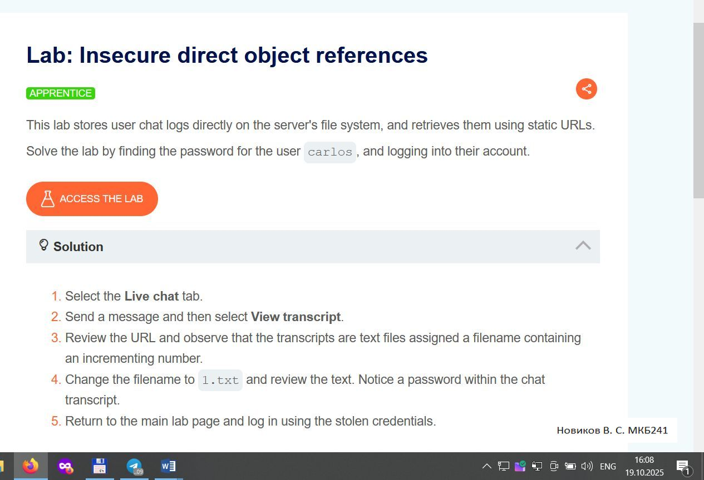
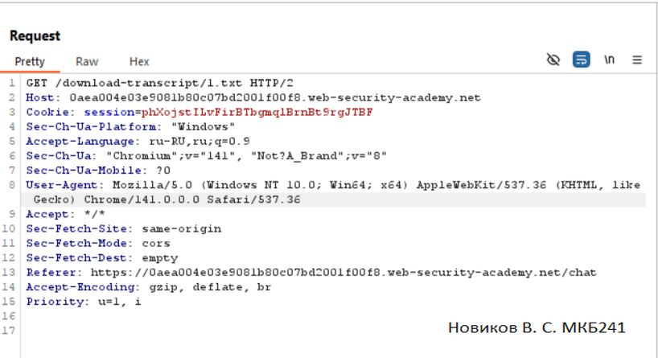
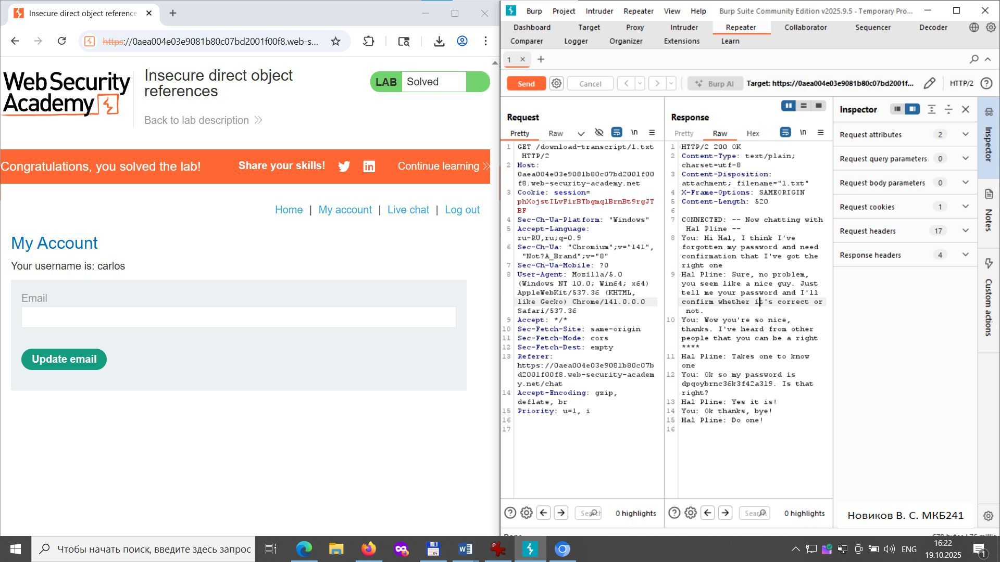

### LAB02 (UserId через параметр)
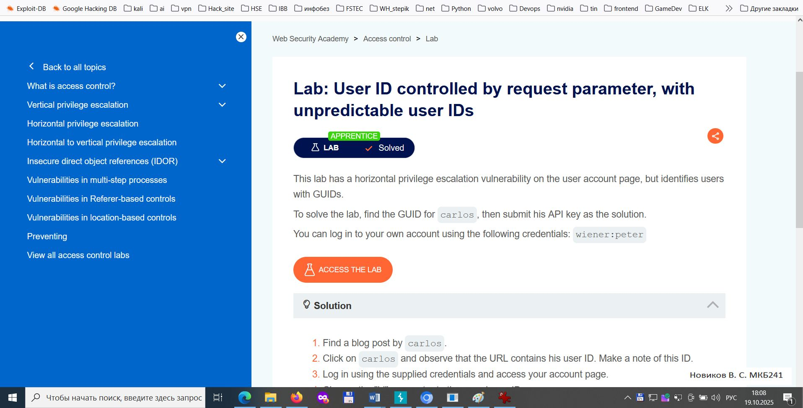
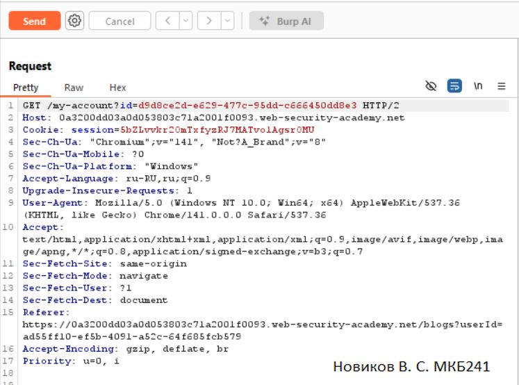
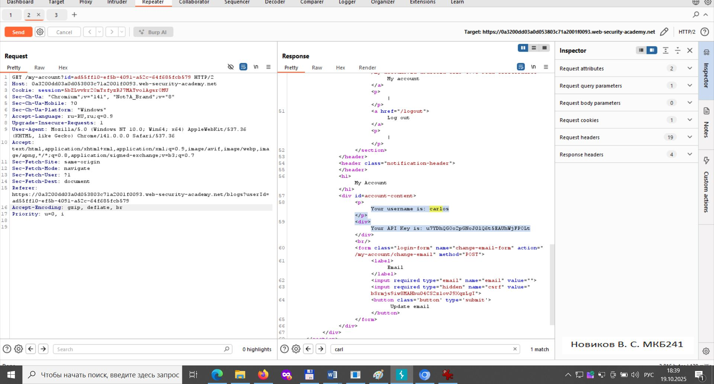
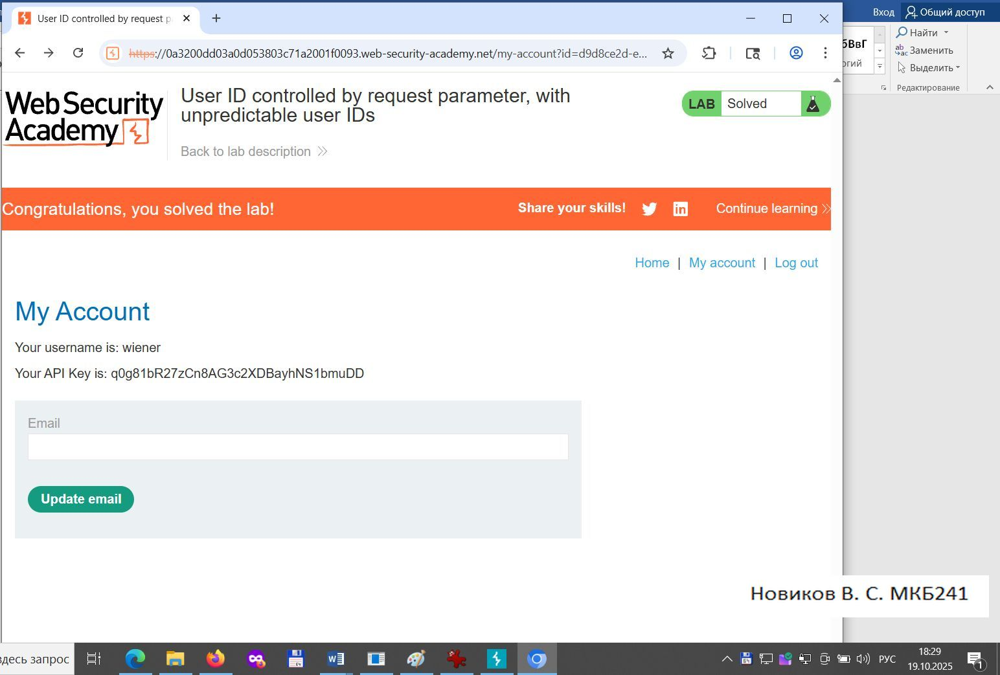

### LAB03 (Path Traversal простой)
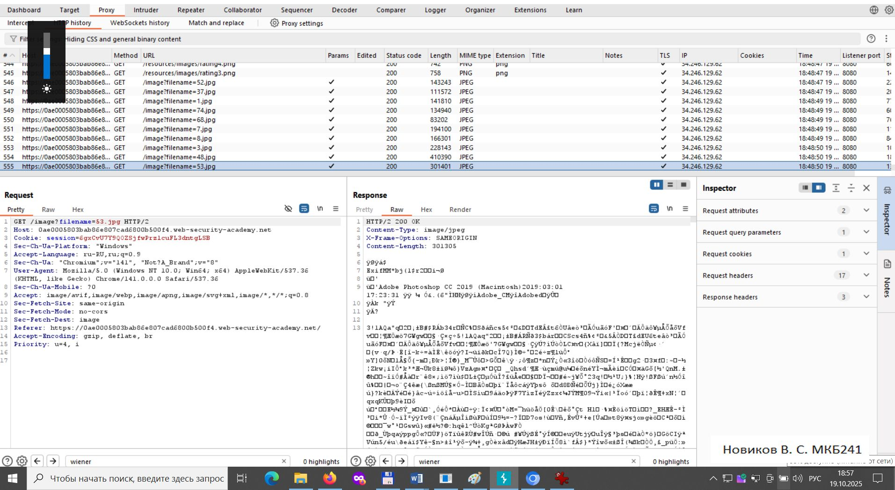
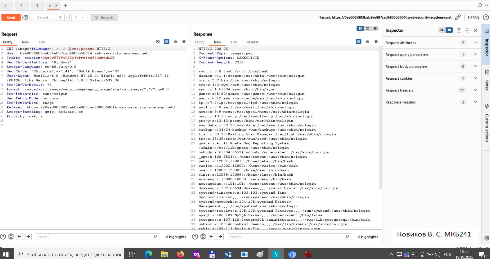
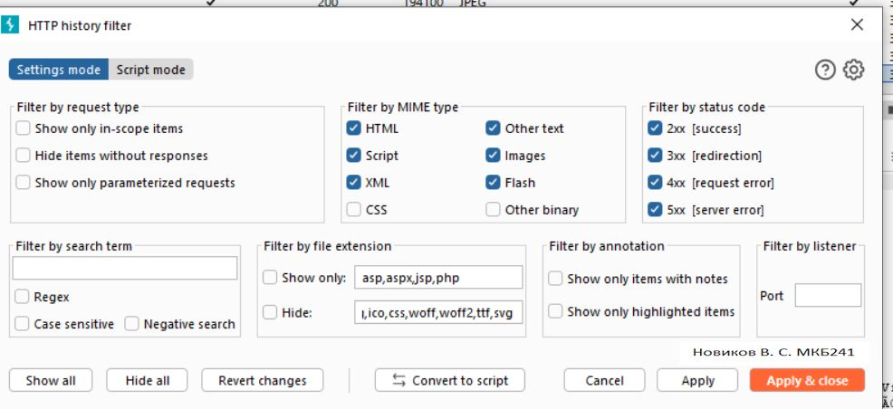

### LAB04 (Path Traversal — обход)
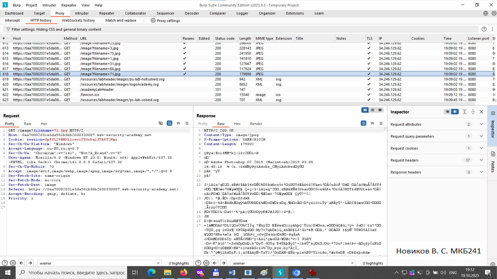
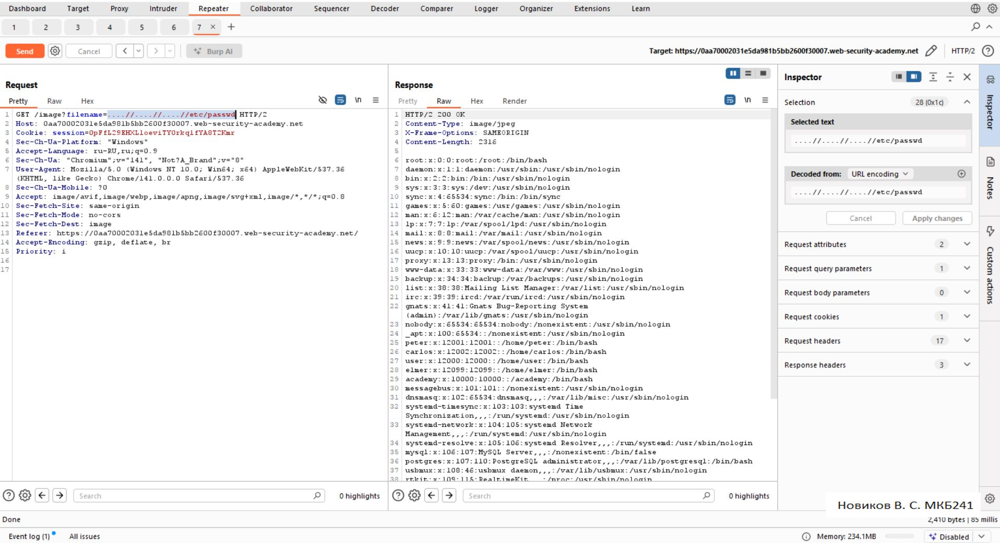
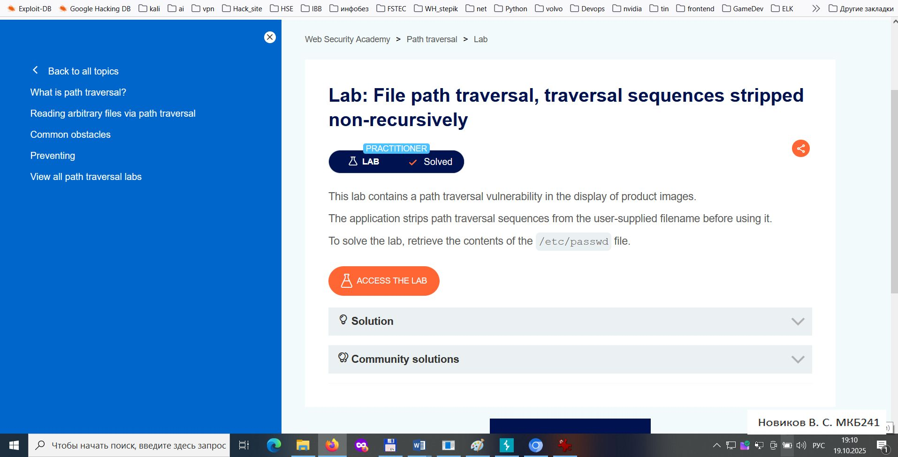

---

## 📑 Рекомендации по оформлению отчёта

- Используйте шаблон отчёта, приложенный в файле `HW_IDOR.docx`.
- На каждом скриншоте должен быть виден Фамилия_Имя_Группа и временная метка (требование методички).
- Каждое задание сопровождайте кратким описанием хода действий (инструменты, изменённые запросы, проверка результата).
- Укажите явно, какой тип IDOR использовался (URL Tampering, Parameter Manipulation, Directory Traversal и т.д.) и какой контрол доступа нарушён (горизонтальный/вертикальный).

---

## 🔐 Юридическое и этическое примечание

Все действия выполнялись в рамках учебных лабораторных упражнений на платформе PortSwigger. Не воспроизводите атаки вне тестовых сред без разрешения владельца ресурса.

---

**© 2025, Новиков В.М. (НИУ ВШЭ, МИЭМ)**
