# Лабораторные работы по JWT (LAB01, LAB02, LAB03)

Репозиторий содержит три выполненные лабораторные работы по теме **уязвимостей JWT**, включая эксплуатацию ошибок проверки подписи, некорректных алгоритмов и атаки Algorithm Confusion.

Файл полностью готов для размещения на GitHub.

---

# 📁 Структура репозитория

```
JWT/
 ├── LAB01/
 │    ├── 01_proxy_winner.jpg
 │    ├── 02_repeater.jpg
 │    ├── 03_JWT.jpg
 │    ├── 04_OK.jpg
 │    ├── 05_del_carlos.jpg
 │    └── 06_solution.jpg
 ├── LAB02/
 │    ├── 01_proxy.jpg
 │    ├── 02_Repeater.jpg
 │    ├── 03_none.jpg
 │    ├── 04_administration.jpg
 │    ├── 05_JWT_del_sign.jpg
 │    ├── 06_del_carlos.jpg
 │    └── 07_solution.jpg
 ├── LAB03/
 │    ├── 01_proxy.jpg
 │    ├── 02_repeat.jpg
 │    ├── 03_json_key.jpg
 │    ├── 04_JWT.jpg
 │    ├── 05_Decode.jpg
 │    ├── 06_gen_key.jpg
 │    ├── 07_new_key_sign.jpg
 │    ├── 08_admin_ok.jpg
 │    ├── 09_del_carlos.jpg
 │    └── 10_solutions.jpg
 └── task/
      ├── HW_JWT.docx
      └── Задание_JWT.pdf
```

---

# 🧩 LAB01 — JWT: обход аутентификации через неподписанный токен

**Источник:**  
https://portswigger.net/web-security/jwt/lab-jwt-authentication-bypass-via-unverified-signature

**Описание:**  
Сервер не проверяет подпись JWT, поэтому злоумышленник может изменить payload без последствий.

**Цель:**  
Изменить `sub: wiener` на `administrator`, получить доступ к `/admin`, удалить пользователя `carlos`.

### Скриншоты:

- 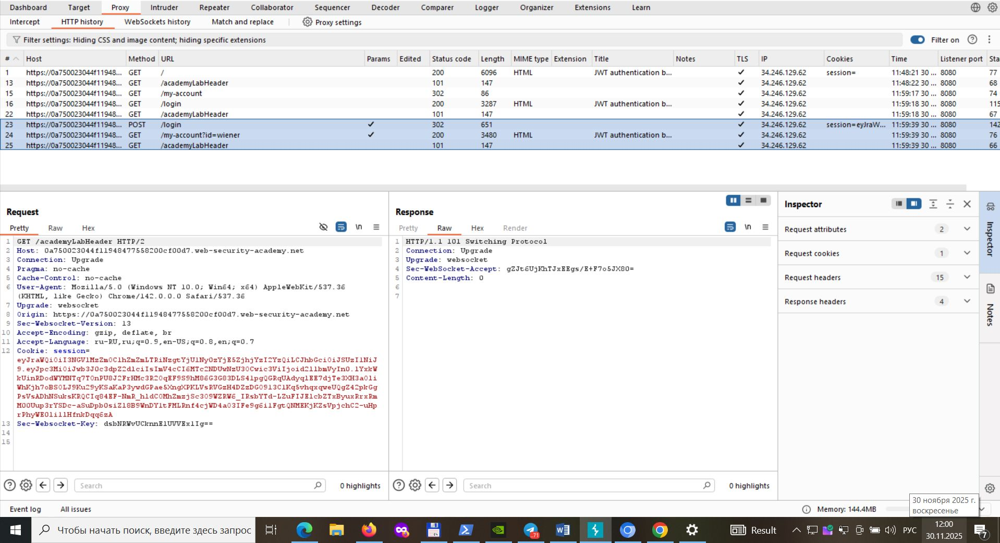
- 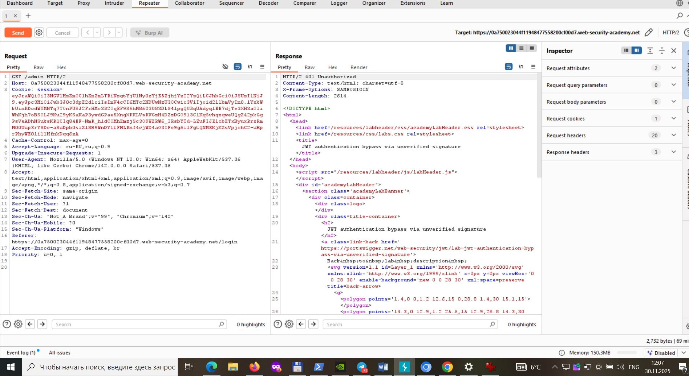
- 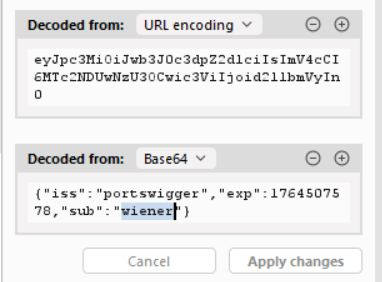
- 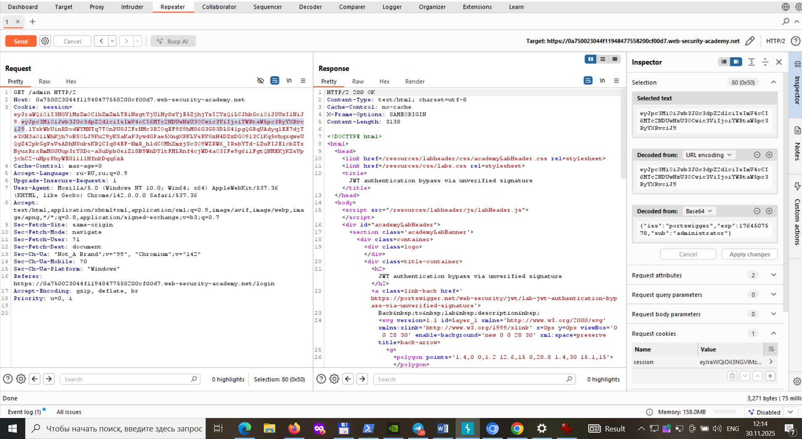
- 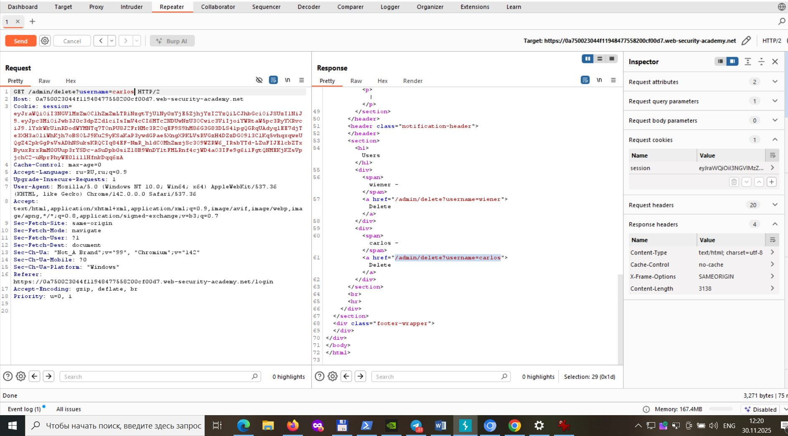
- 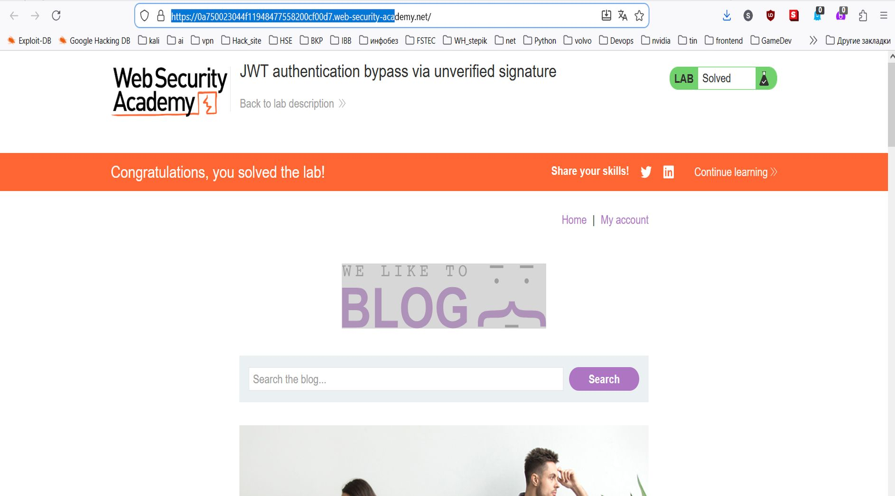

---

# 🧩 LAB02 — JWT: alg=none (обход проверки подписи)

**Источник:**  
https://portswigger.net/web-security/jwt/lab-jwt-authentication-bypass-via-flawed-signature-verification

**Описание:**  
Параметр `alg=none` отключает проверку подписи — сервер принимает токен как валидный.

**Цель:**  
Изменить payload (`sub=administrator`), установить `alg=none`, удалить подпись, получить доступ к `/admin`.

### Скриншоты:

- 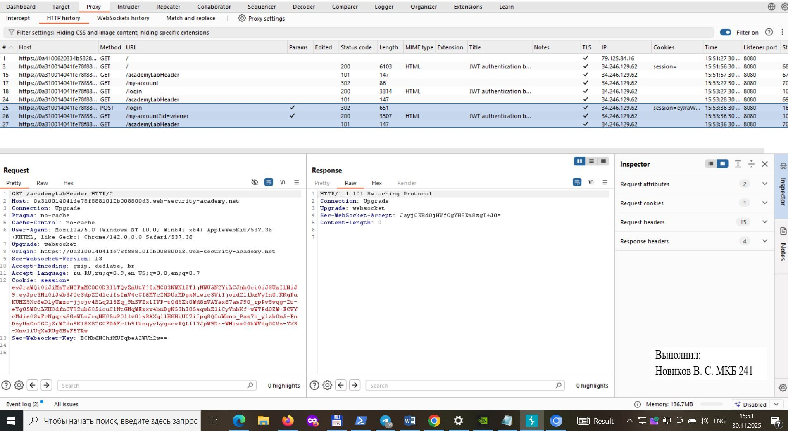
- 
- 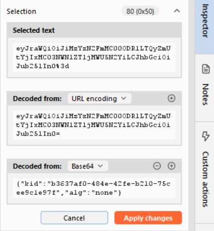
- 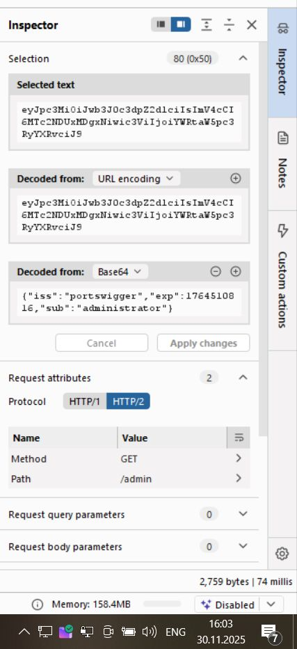
- 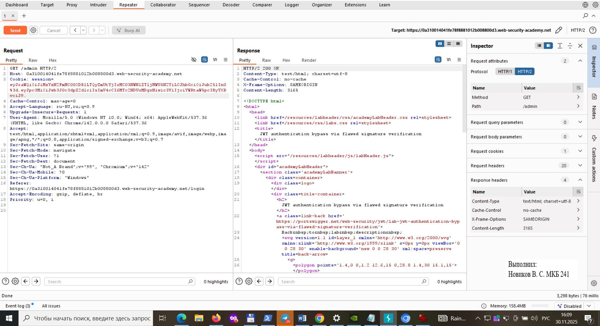
- 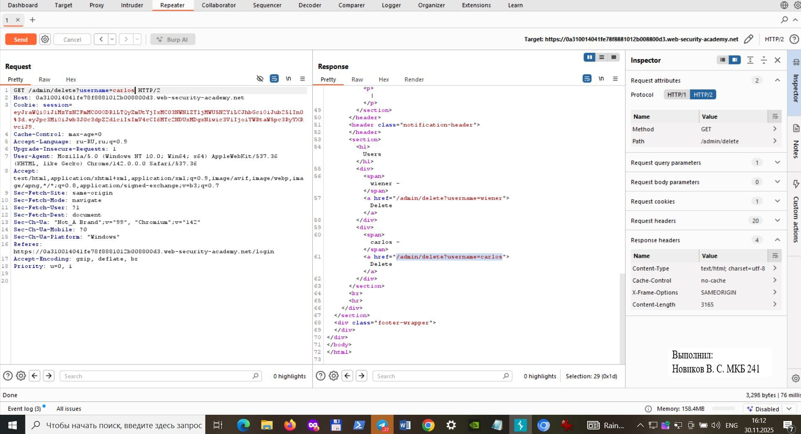
- 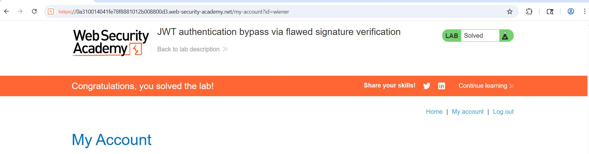

---

# 🧩 LAB03 — Algorithm Confusion (RS256 → HS256)

**Источник:**  
https://portswigger.net/web-security/jwt/algorithm-confusion/lab-jwt-authentication-bypass-via-algorithm-confusion

**Описание:**  
Сервер неверно интерпретирует заголовок `alg`, позволяя использовать публичный RSA-ключ как секрет для HS256.

**Цель:**  
Получить публичный ключ из `/jwks.json`, преобразовать его в Base64, создать ключ HS256 и подписать поддельный токен.

### Скриншоты:

- 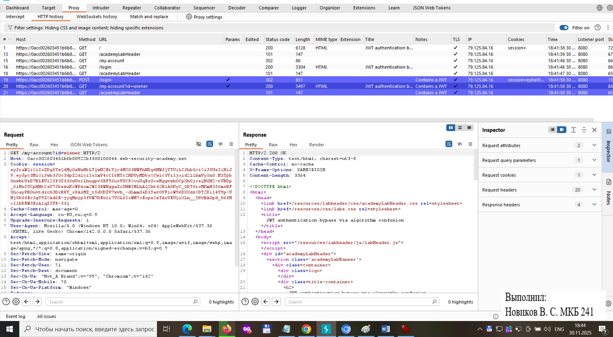
- 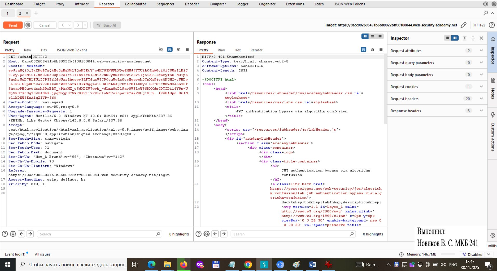
- 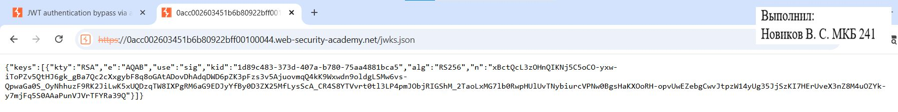
- 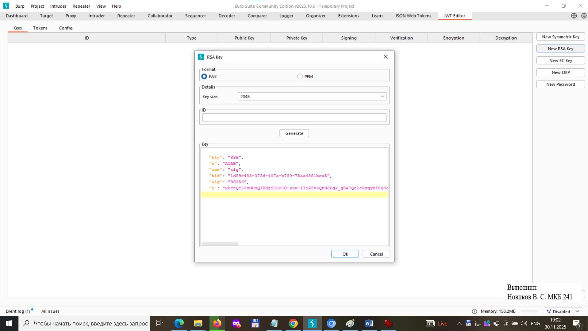
- 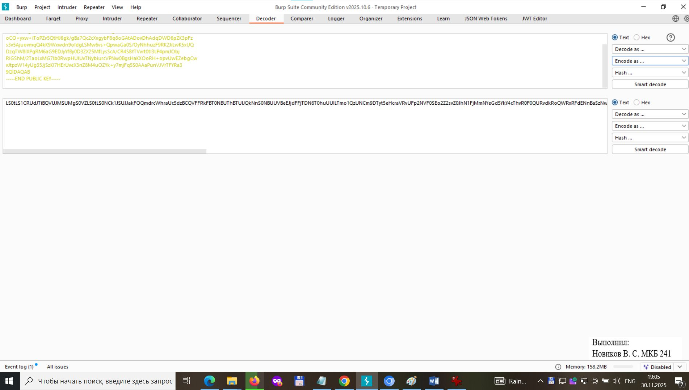
- 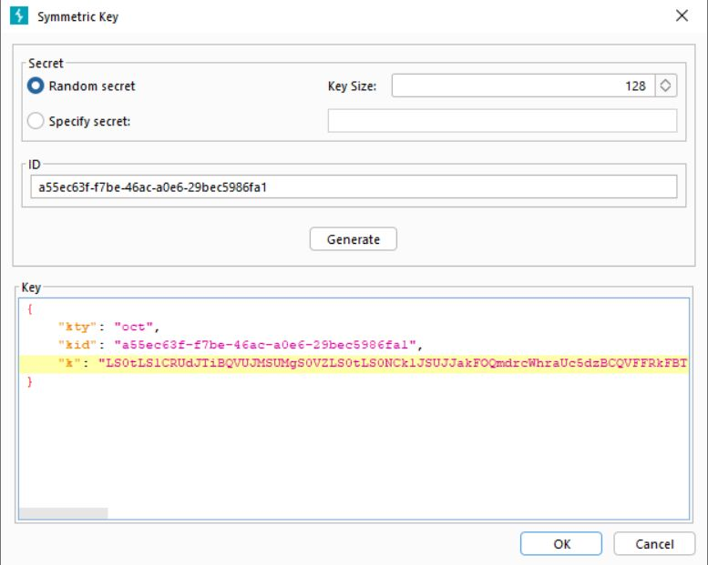
- 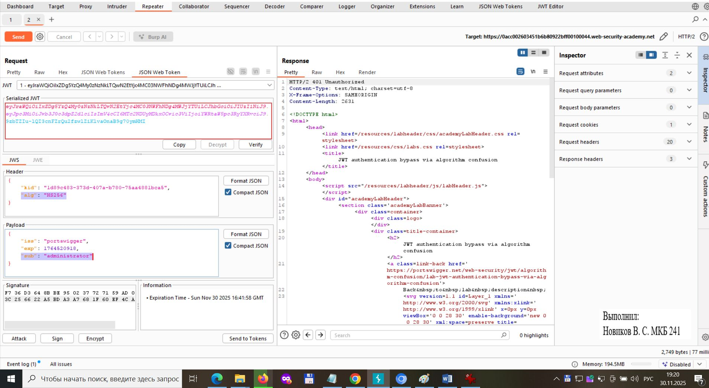
- 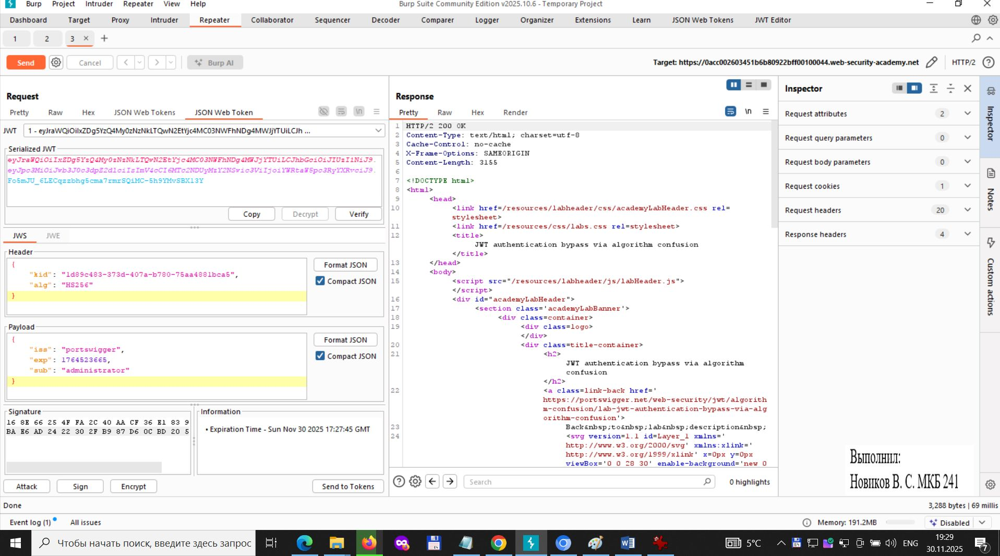
- 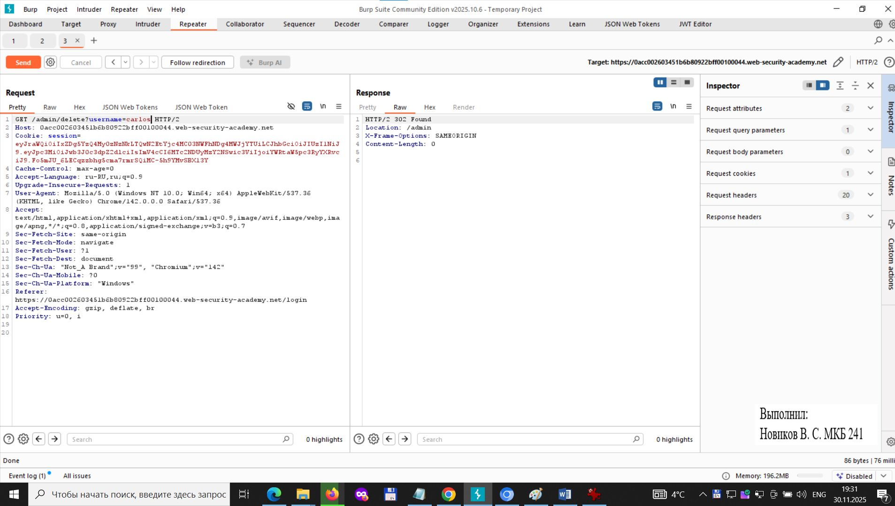
- 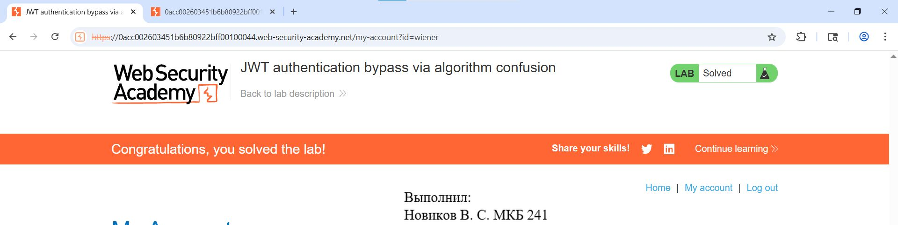

---

# 📄 Документы

- **HW_JWT.docx** — отчёт с полным описанием лабораторных  
  → [Скачать HW_JWT.docx](HW_JWT.docx) fileciteturn3file0

- **Задание_JWT.pdf** — методическое задание  
  → [Скачать Задание_JWT.pdf](Задание_JWT.pdf) fileciteturn3file1

---

# 📌 Рекомендации по защите JWT

- Отключить поддержку `alg=none`.
- Фиксировать алгоритм подписи на стороне сервера.
- Не доверять ключам, переданным в заголовке (`jwk`, `kid`).
- Использовать проверку подписи по RSA/EC ключам.
- Ограничивать срок жизни токена (`exp`) и проверять `iss`, `aud`.
- Проводить ротацию ключей.

---

# ✔ Готово к загрузке

Данный README.md полностью соответствует требованиям оформления и может быть размещён в GitHub без изменений.

