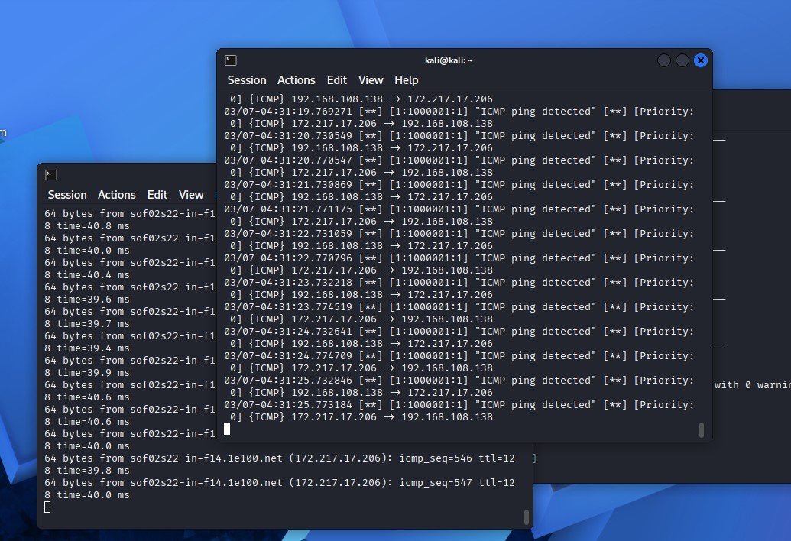
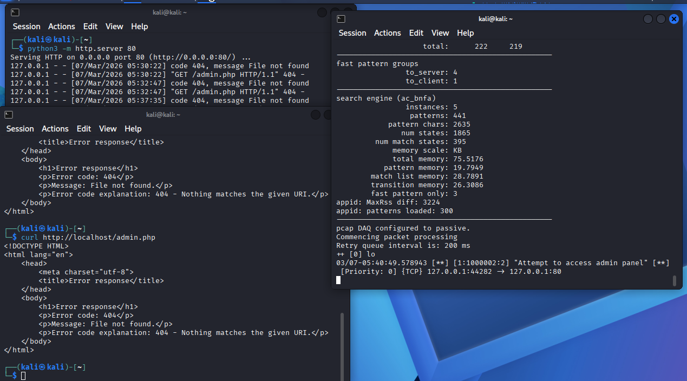
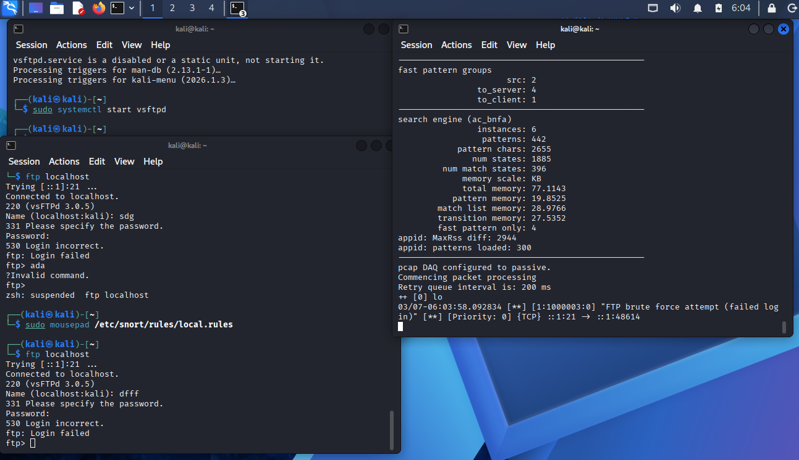

# Snort — Лабораторная работа

Лабораторная работа по дисциплине **Network and System Security**  
Образовательная программа **Информационная безопасность**  
НИУ ВШЭ, МИЭМ им. А.Н. Тихонова

Студент: **Новиков В.С.**  
Группа: **МКБ-241**

---

# Описание

В лабораторной работе изучается работа системы обнаружения вторжений **Snort**.

В ходе работы:

- установлена IDS Snort
- проверена конфигурация системы
- написаны пользовательские правила обнаружения атак
- протестированы сигнатуры на реальном сетевом трафике

---

# Установка Snort

Обновление пакетов:

```bash
sudo apt update
```

Установка Snort:

```bash
sudo apt install -y snort
```

---

# Проверка интерфейсов

```bash
ip a
```

Пример:

```
eth0: 192.168.108.138
lo:   127.0.0.1
```

---

# Проверка конфигурации Snort

```bash
sudo snort -T -c /etc/snort/snort.lua
```

Результат:

```
Snort successfully validated the configuration
```

---

# Правило №1  
## Обнаружение ICMP ping

Правило:

```snort
alert icmp any any <> any any (msg:"ICMP ping detected"; sid:1000001; rev:1;)
```

Описание:

Правило обнаруживает ICMP-пакеты (ping) между любыми узлами сети.

### Скриншот



---

# Правило №2  
## Обнаружение доступа к admin панели веб-сервера

Цель — обнаружить HTTP-запрос:

```
GET /admin.php
```

Правило:

```snort
alert http any any -> $HOME_NET any (msg:"Attempt to access admin panel"; flow:to_server,established; http_method; content:"GET",nocase; http_uri; content:"/admin.php",nocase; sid:1000002; rev:2;)
```

### Логика правила

| Опция | Назначение |
|------|------------|
| msg | текст предупреждения |
| flow | анализ трафика к серверу |
| http_method | анализ HTTP метода |
| content:"GET" | проверка метода GET |
| http_uri | анализ URI запроса |
| content:"/admin.php" | поиск пути admin |
| sid | идентификатор правила |

### Тестирование

Запуск тестового веб-сервера:

```bash
python3 -m http.server 80
```

Отправка запроса:

```bash
curl http://localhost/admin.php
```

### Скриншот



---

# Правило №3  
## Обнаружение FTP brute force

При неверной авторизации FTP сервер возвращает код:

```
530 Login incorrect
```

Правило:

```snort
alert tcp $HOME_NET 21 -> any [1025:] (msg:"FTP brute force attempt (failed login)"; flow:to_client,established; content:"530 Login incorrect",nocase; sid:1000003;)
```

### Тестирование

Установка FTP сервера:

```bash
sudo apt install vsftpd
```

Запуск:

```bash
sudo systemctl start vsftpd
```

Подключение:

```bash
ftp localhost
```

Ввод неверного пароля:

```
530 Login incorrect
```

### Скриншот



---

# Правило №4  
## Обнаружение XMAS Scan

XMAS scan — тип сканирования портов, при котором одновременно установлены TCP-флаги:

- FIN
- PSH
- URG

Правило:

```snort
alert tcp any any -> any any (msg:"XMAS scan detected"; flags:FPU; sid:1000004; rev:1;)
```

### Проверка

Запуск сканирования:

```bash
nmap -sX 127.0.0.1
```

При обнаружении Snort выводит сообщение:

```
[**] [1:1000004:1] XMAS scan detected [**]
```

---

# Структура проекта

```
snort
│
├─ doc
│  ├─ snort.docx
│  └─ Snort.pdf
│
├─ screen
│  ├─ ftp.png
│  ├─ admin_php.png
│  └─ ICMP.jpg
│
└─ README.md
```

---

# Итог

В ходе лабораторной работы:

- изучена архитектура IDS **Snort**
- написаны пользовательские правила обнаружения атак
- реализовано обнаружение:

| Тип события | SID |
|--------------|------|
| ICMP ping | 1000001 |
| доступ к admin панели | 1000002 |
| FTP brute force | 1000003 |
| XMAS scan | 1000004 |

Snort успешно обнаруживает указанные сетевые события.
