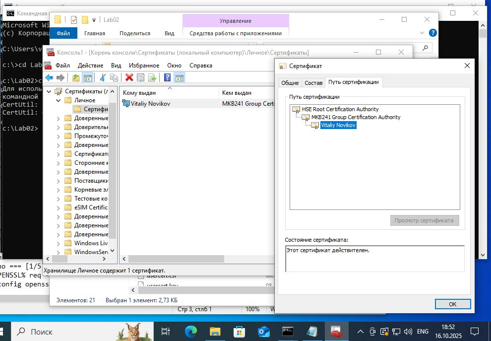

# Лабораторная работа №2 — Создание контейнера PKCS#12 и проверка экспортируемости приватного ключа

**Дисциплина:** Криптография / Безопасность сетей и систем  
**Автор:** Vitaliy Novikov, группа МКБ241  
**Дата выполнения:** 16.10.2025  

---

## 🎯 Цель работы

Изучить процесс объединения цепочки сертификатов в контейнер PKCS#12 (.p12) и импортировать его в хранилище Windows с проверкой возможности экспорта приватного ключа.

---

## 📁 Структура проекта

```
PKI/
└── LAB02/
    ├── cert/                # Сгенерированные сертификаты
    │    ├── groupmca.crt
    │    ├── rootca.crt
    │    ├── usercert.crt
    │    └── final.p12
    │
    ├── conf/                # Конфигурационные файлы
    │    ├── do_it.bat
    │    ├── openssl.cnf
    │    └── vm.txt
    │
    ├── screen/              # Скриншоты выполнения
    │    └── mmc.jpg
    │
    ├── task/                # Методические материалы
    │    └── Лабораторная работа 2 (2023).pdf
    │
    └── README.md            # Отчёт по лабораторной работе
```

---

## ⚙️ Используемое ПО

- **OpenSSL 1.0.2j-FIPS (26 Sep 2016)** — версия, предоставленная преподавателем  
- **Windows 10 / 11**
- **certutil** (встроенная утилита Windows)
- **certmgr.msc / mmc** — просмотр и экспорт сертификатов

---

## 🧩 Подготовка

1. Создана папка `PKI/LAB02`
2. Скопированы файлы из предыдущей лабораторной работы (`LAB01`)
3. В начале скрипта `do_it.bat` добавлена строка для указания конфигурации OpenSSL:

```bat
set OPENSSL_CONF=%~dp0openssl.cnf
```

---

## 🧾 Основные шаги выполнения

### 1️⃣ Обновление скрипта `do_it.bat`

Добавлены изменения для выполнения требований ЛР-2:

- Размер ключей увеличен до **8192 бит**
- Добавлены два пароля:
  - `PASS_KEY` — для закрытых ключей сертификатов
  - `PASS_PFX` — для контейнера PKCS#12
- Добавлен импорт сертификата через `certutil`

Фрагмент кода:

```bat
set PASS_KEY=HSEPassw0rd
set PASS_PFX=UserPass123
```

---

### 2️⃣ Генерация цепочки сертификатов

Создаётся трёхуровневая цепочка:

1. **Root CA** — HSE Root Certification Authority  
2. **Group CA** — MKB241 Group Certification Authority  
3. **User Cert** — Vitaliy Novikov  

Сертификаты объединяются в один файл:

```cmd
type usercert.crt groupmca.crt rootca.crt > certs.crt
```

---

### 3️⃣ Создание контейнера PKCS#12

Формируется контейнер, включающий приватный ключ и цепочку сертификатов:

```cmd
openssl pkcs12 -export -in certs.crt -inkey usercert.key -out final.p12 ^
 -passin pass:HSEPassw0rd -passout pass:UserPass123
```

---

### 4️⃣ Импорт сертификата в Windows

Импорт в системное хранилище (локальный компьютер):

```cmd
certutil -f -p UserPass123 -importpfx final.p12
```

Импорт в личное хранилище пользователя:

```cmd
certutil -user -f -p UserPass123 -importpfx final.p12
```

---

### 5️⃣ Проверка результатов

#### 📍 Проверка через MMC

1. `Win + R` → `mmc`
2. Файл → Добавить/удалить оснастку → Сертификаты → Учётная запись компьютера → Локальный компьютер  
3. Перейти в **Личное → Сертификаты**
4. Убедиться, что установлен сертификат **Vitaliy Novikov**, цепочка до **MKB241 → HSE**



#### 📸 Проверка экспортируемости ключа

1. В свойствах сертификата открыть вкладку **Состав (Details)**  
2. Запустить **Мастер экспорта**  
3. Проверить наличие активной опции **«Да, экспортировать закрытый ключ»**

---

## ✅ Результаты

- Сформирован контейнер **final.p12**
- Сертификат импортирован в систему и отображается в оснастке MMC
- Приватный ключ экспортируемый (по заданию ЛР-2)
- Все параметры лабораторной работы выполнены

---

## 📚 Автор

**Vitaliy Novikov**  
НИУ ВШЭ, группа МКБ241  
2025 г.
