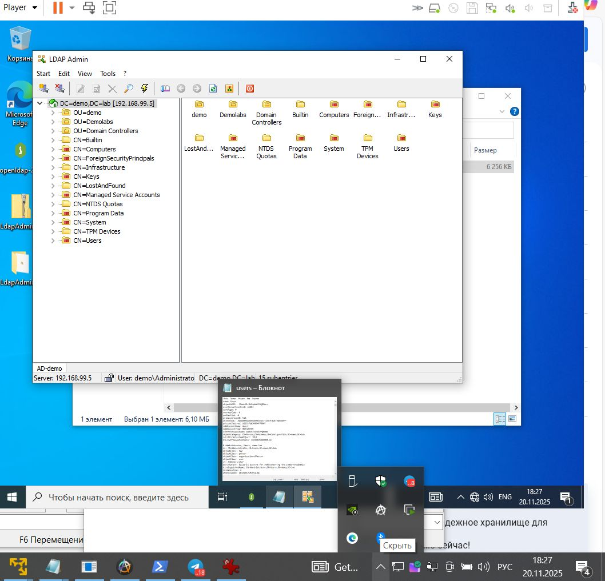
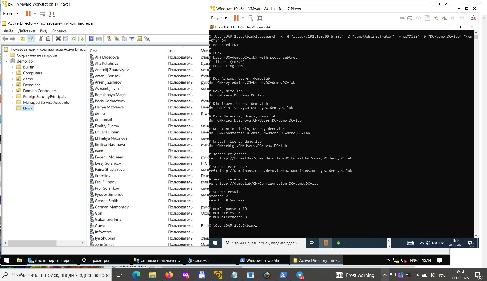

# Лабораторная работа №5  
## Протокол LDAP. Работа с LDAP Admin и OpenLDAP  
**Дисциплина:** Криптографические методы защиты информации  
**ВШЭ, 2025**

---

## 📁 Структура проекта

```
HomeWorks/
└── PKI/
    └── LAB05/
        ├── pics/          # Скриншоты выполнения
        │   ├── ldap_admin.jpg
        │   └── ldapsearch.jpg
        │
        ├── scripts/       # Выгрузки и команды для ldapsearch
        │   ├── users_info.txt
        │   ├── command.txt
        │   ├── pki_system_working_final.py
        │   └── openssl.cnf
        │
        └── task/
            └── Лабораторная работа 5, изм.1 (2023).pdf
```

---

# Часть 1. Работа с LDAP Admin



Для практического знакомства с протоколом LDAP был выполнен вход на удалённый контроллер домена Windows Server 2019 с помощью GUI-клиента **LDAP Admin**.

### **Параметры подключения:**
- **Host:** `192.168.99.5`  
- **Port:** `389`  
- **Base DN:** `DC=demo,DC=lab`  
- **Bind DN:** `Administrator@demo.lab`  
  или  
  `demo\Administrator`
- **Auth:** Simple bind (LDAP v3)

### **Результаты:**
- выполнено успешное подключение к AD;
- изучена структура каталога:
  - пользователи (CN=Users)
  - компьютеры (OU=Computers)
  - контроллеры домена (OU=Domain Controllers)
- просмотрены атрибуты объектов:
  - `cn`
  - `sAMAccountName`
  - `userPrincipalName`
  - `memberOf`
  - `objectGUID`
  - `operatingSystem` (для компьютеров)

---

# Часть 2. Работа с OpenLDAP (консоль)



Команды выполнялись с клиента Windows 10, на который установлен OpenLDAP 2.6.9.

## 🔹 **1. Неверная попытка подключения**

```bash
ldapsearch -x -H "ldap://192.168.2.200:38938" -b "DC=demo,DC=lab" -D Administrator -w xxXX1234 "(CN=K*)" DN
```

Ошибка: `Can't contact LDAP server (-1)`  
Причина — неверный порт (38938).

---

## 🔹 **2. Корректное подключение**

```bash
ldapsearch -x -H "ldap://192.168.99.5:389"   -D "demo\Administrator"   -w xxXX1234   -b "DC=demo,DC=lab" "(objectClass=user)"
```

---

## 🔹 **3. Выгрузка списка пользователей**

```bash
ldapsearch -x -H "ldap://192.168.99.5:389"   -D "demo\Administrator"   -w xxXX1234   -b "DC=demo,DC=lab" "(objectClass=user)" > users.ldif
```

Файл сохранён в `scripts/users_info.txt`.

---

# ✔ Итоги выполнения лабораторной работы

| Часть | Статус |
|-------|--------|
| **1. LDAP Admin (GUI)** | Выполнено |
| **2. OpenLDAP (CLI)** | Выполнено |

---

# Автор  
**ФИО:** Novikov V. S.   
**Группа:** МКБ241  
**Дата:** 20.11.2025
